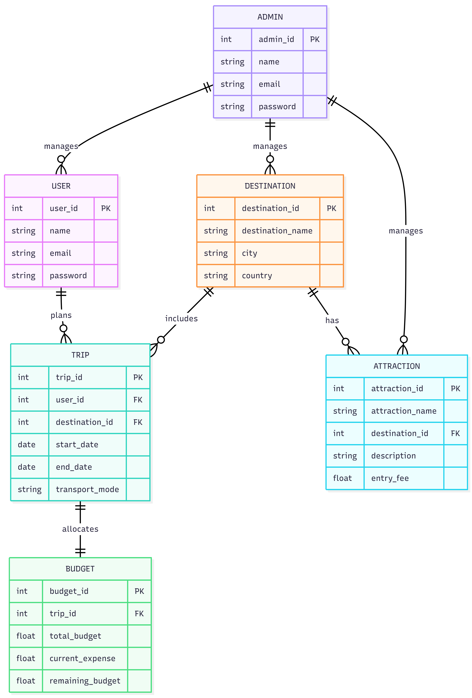

# TripMate – DBMS-Based Itinerary Planner 

TripMate is a **database-driven itinerary planning web application** designed using **MySQL, Python (Flask), HTML, CSS, and JavaScript**.
The project focuses on efficient **database design, querying, and management**, while providing a user-friendly interface for trip planning and budget tracking.

A **separate Admin Dashboard** is included to manage users, destinations, attractions, trips, and budgets directly through the database using backend cursor-based operations.

---

## Project Overview

TripMate allows users to:

* Plan trips by selecting destinations, travel dates, and preferred transport
* Track trip budgets and remaining expenses
* View and manage their saved trips
* Interact with a clean, responsive frontend

Admins can:

* Manage database records efficiently via a dedicated admin interface
* Add, update, delete, and filter destinations and attractions
* Monitor users, trips, and budgets
* Perform database operations using backend **MySQL cursors**

---

## Tech Stack

### Frontend

* **HTML5**
* **CSS3**
* **JavaScript**

### Backend

* **Python (Flask)**
* **MySQL**
* **MySQL Connector (Cursor-based queries)**

---

##  Core Features

###  User Features

* **Trip Planning**

  * Select country, city, area, dates, and transport mode
  * Generate a structured itinerary
* **Budget Tracker**

  * Set a total budget
  * Track expenses
  * View remaining budget dynamically
* **User Dashboard**

  * View and manage planned trips
  * Update profile details

### Admin Features

* **Admin Authentication**

  * Separate admin login from users
* **Database Management**

  * Manage users, destinations, attractions, trips, and budgets
  * Perform CRUD operations using backend cursors
* **Filtering & Search**

  * Filter destinations and records
  * Search-based database queries
* **Dashboard Analytics**

  * Total users
  * Total destinations
  * Total attractions
  * Total trips
  * Total budgets

---

## Database Design

* Database created using **datasets sourced from Kaggle**
* Data was:

  * Cleaned
  * Normalized
  * Enhanced with **synthetically generated values** using Python
* Designed to support:

  * Efficient querying
  * Filtering
  * Admin-side data manipulation
* Backend uses **cursor-based execution** for all database operations

---

## Entity Relationship (ER) Diagram

The following ER diagram represents the database design of the TripMate system.




## Project Structure (High-Level)

```
TripMate/
│
├── server.py / app.py        # Flask backend
├── api/                      # Backend API routes
│
├── frontend/
│   ├── LoginPage/
│   ├── SignUpPage/
│   ├── UserDashboard/
│   ├── TripPlanner/
│   ├── My_Trips/
│   └── ProfileSettings/
│
├── Admin Users/
│   ├── users.html
│   ├── AdminUsersScripts.js
│   └── AdminUsersStyles.css
│
├── database/
│   ├── schema.sql
│   └── sample_data.sql
│
└── README.md
```

---

##  How It Works

1. **User Interaction**

   * User inputs trip details via frontend
   * Requests sent to Flask backend using JavaScript

2. **Backend Processing**

   * Flask handles requests
   * MySQL queries executed using cursors
   * Data fetched, updated, or inserted as required

3. **Admin Operations**

   * Admin actions trigger backend routes
   * Cursor-based queries modify database records
   * Changes reflected instantly on the dashboard

---

## Setup Instructions

### 1️⃣ Clone the Repository

```bash
git clone https://github.com/mahak-modani/TripMate-DBMS.git
cd TripMate-DBMS
```

### 2️⃣ Install Dependencies

```bash
pip install flask mysql-connector-python
```

### 3️⃣ Configure MySQL

* Create a MySQL database
* Import provided SQL files
* Update database credentials in the Flask backend

### 4️⃣ Run the Application

```bash
python server.py
```

Open in browser:

```
http://localhost:5000
```

---

## Learning Outcomes

* Practical understanding of **DBMS concepts**
* Hands-on experience with:

  * SQL queries
  * Cursor-based database interaction
  * Backend–frontend integration
* Designing admin panels for database management
* Working with real-world datasets and data cleaning

---

## 📈 Future Enhancements

* Advanced budget analytics
* Graph-based expense visualization
* Role-based access control
* Improved filtering and sorting
* API-based destination suggestions
